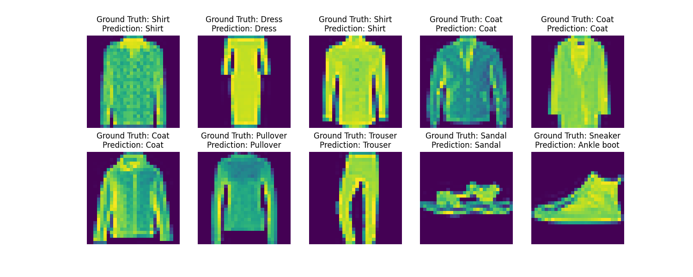
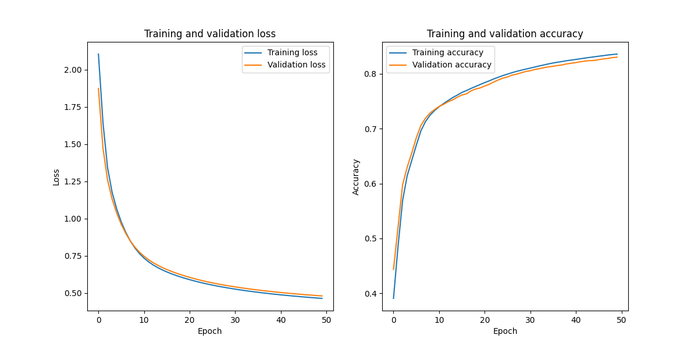

[](https://www.paypal.me/CamponogaraViera/100)
[](#)
[](https://www.python.org/downloads/source/)
[](https://github.com/QuCAI-Lab/vanilla-numpy-mlp/pulls)
[](https://github.com/QuCAI-Lab/vanilla-numpy-mlp/graphs/commit-activity)
[](LICENSE.md)

<!-- Title: -->
<div align="center">
  <h1> Vanilla NumPy MLP Neural Network with SGD and Backpropagation </h1>
</div>
    
# Dependencies

<a href="https://www.python.org/" target="_blank" rel="noopener noreferrer"></a>
<a href="https://matplotlib.org" target="_blank" rel="noopener noreferrer"></a>
<a href="https://numpy.org/" target="_blank" rel="noopener noreferrer"></a>
<br>

# About

Implementation of vanilla NumPy multilayer perceptron (MLP). This is a fully-connected feedforward neural network with Stochastic Gradient Descent (SGD) optimizer and backpropagation. The implementation was trained/tested using the Fashion-MNIST dataset for image classification. Resort to the [theory.ipynb](theory.ipynb) notebook for a theoretical background and derivation of the backpropagation algorithm considering `Sigmoid`, `Softmax`, `MSE`, and `Categorical Cross-Entropy` functions.

In order to comply with GitHub's limit on large files, the dataset folder was git ignored. Download the [Fashion MNIST](https://www.kaggle.com/datasets/zalando-research/fashionmnist) dataset, extract it, then yank and paste the train and test files to a `dataset/` folder in the root directory of your local clone.

> This material is designed to educate by bridging the gap between theory and implementation. If there is a blunder, do not hesitate to open an issue in the issue tracker.

<div align="center">
  <a href="#"></a>
  <a href="#"></a>
</div> 

# Table of Contents

- [fmnist_backprop_numpy.ipynb](fmnist_backprop_numpy.ipynb):
    - Architecture: MLP with two fully-connected hidden layers. Has support for two loss functions (**mse** and **cross-entropy**), three weight initializations (**xavier**, **he** or **normal**), **L2 regularization**, and training by batches.
    - Framework and Libraries: NumPy.
    - Dataset: [Fashion MNIST](https://www.kaggle.com/datasets/zalando-research/fashionmnist).

# Conda env.

```bash
conda create -yn mlp python==3.11.3 && conda activate mlp \
&& conda install -yc conda-forge pip==23.2.1 && python -m pip install --user --upgrade pip \
&& python -m pip install -r requirements.txt
```
